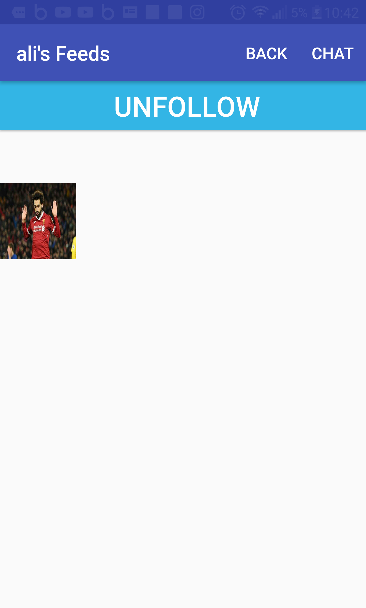
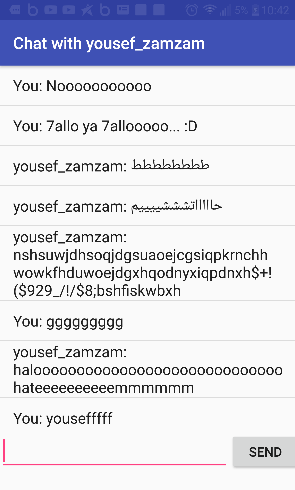
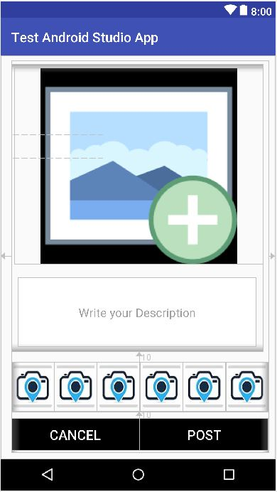

# PhotoMe-Android-App-Share-Your-Photos-with-Friends-
This is and android application programmed with Java to share pictures between people who follow each other.
The backend programming and database based on Parse-Server "back4app".

## The App consists of 6 activities till now:
### LogIn/SignUP Acitivity.

 

### Friends Feeds Activity:
+ Preview images posts of the users you follow.
+ To see next new images, press on ">" arrow button.
+ To see previous images, press on "<" arrow button.
+ To Share a new photo press on "Share" button.
+ Switch between activities with the bar of buttons on the top of screen.
+ Like photos property is working.
+ Comment on image hasn't been done yet.

 

### User List Activiy:
- this activity shows all the users of the app, and sorting them by createdAt users.
- When click on any user in the listview, it shows his/her profile.
- Logout button to sign out of your account.
- "Share" Button to direct post a photo from your gallery.

 

### User Profile Feeds:
- Preview images of current opened user profile.
- "Back" button to get back to friends activity.
- "chat" button, to go to chat activity for messaging with current user friend.
- "Follow/Unfollow" button, to follow or unfollow a user to follow his/her images posts.

 

### Chat Acitivty: (regular messaging Not live yet).
- An edit text field to write text in it.
- "Send" button, to send written text to this opened user profile.

 

### Share Photo Activity.
- When click on add photo image, it switch you to your gallery to choose the image you want to share.
- "Post" button, to share the selected image with friends,
- "Cancel" to get back to friends feeds activity without sharing anything.
- Small camera images to add effects to the selected image (but it hasn't beed done yet searching for nice effects :p :D).

 

