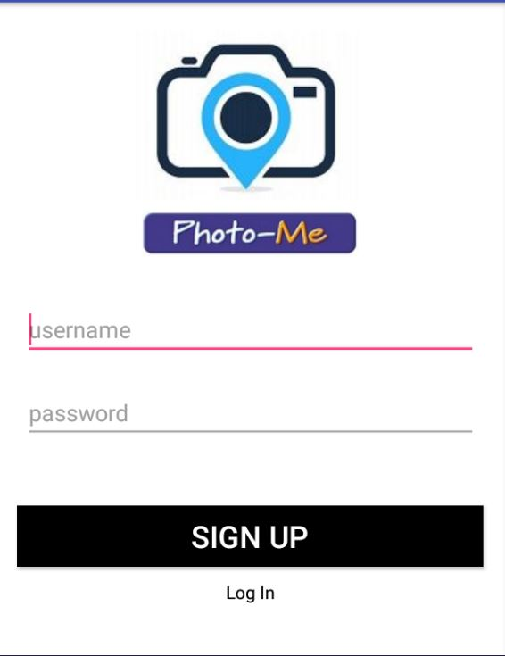
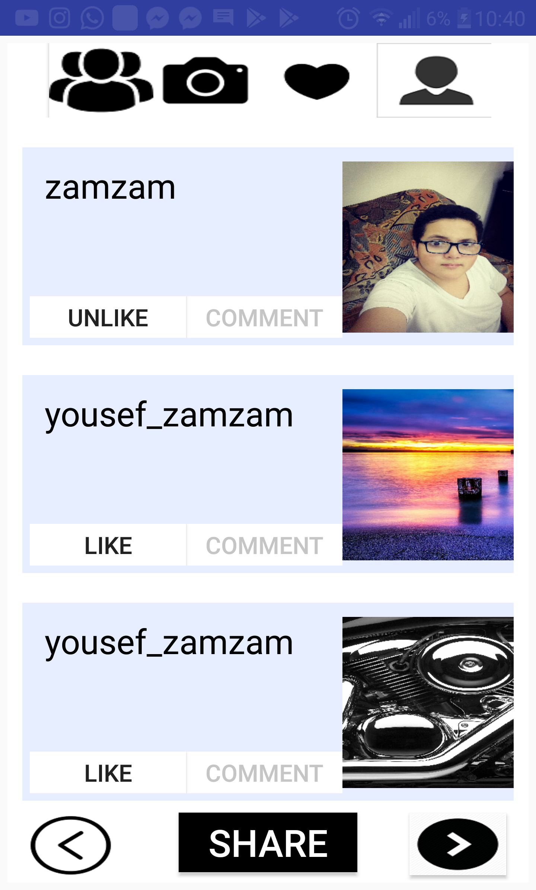
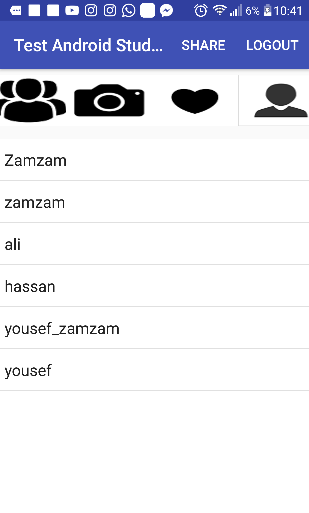

# PhotoMe-Android-App-Share-Your-Photos-with-Friends-
This is and android application programmed with Java to share pictures between people who follow each other.
The backend programming and database based on Parse-Server "back4app".

## The App consists of 6 activities till now:
+ LogIn/SignUP Acitivity.

 

+ Friends Feeds Activity.

 

+ User List Activiy.

 

+ User Profile Feeds.

 

+ Chat Acitivty (regular messaging Not live yet).

 

+ Share Photo Activity.

 

